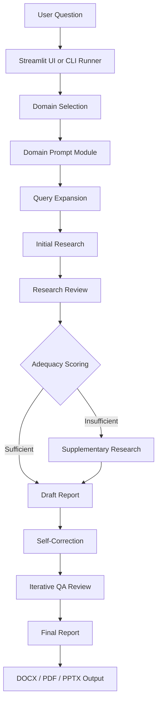

<p align="center">
  
</p>

<h1 align="center">A1trategize - Your AI Strategy Team</h1>

<p align="center">
  <strong>Local Multi-Agent Strategic Report Generation System</strong>
</p>

<p align="center">
  <a href="LICENSE"></a>
  
  
  
  
  
</p>

<p align="center">
  <em>Release: <a href="https://github.com/minseok-ai/Minseok-Song/commit/95e34abf88a5f932d604ee6f50036f5aa9777d3c">Initial deployment</a> · Author: Minseok Song &amp; Company</em>
</p>

<p align="center">
  <a href="README.md">한국어</a> | <strong>English</strong>
</p>

---

## Overview

**A1trategize** is a local multi-agent strategic analysis system that combines specialized AI roles to produce business strategy, career strategy, and IP/patent strategy reports.

The Initial deployment takes a user question, selects the appropriate domain, gathers research material, reviews the evidence, checks adequacy, performs supplementary research when needed, drafts the report, applies self-correction, runs iterative QA, and saves the result as document outputs. The system is not a single-response generator; it separates research, critique, drafting, revision, and QA responsibilities across model roles and rule-based checks.

The public repository is a technical-report space. It does not include implementation source code, full prompt text, provider credentials, private data, or generated reports. This document describes the publicly shareable system structure and pipeline.

### Why A1trategize?

| Conventional approach | A1trategize Initial deployment |
|---|---|
| Reliance on one LLM response | Separate research, review, drafting, revision, and QA roles |
| Raw user query sent directly to search or generation | Query expansion structures the research perspective |
| Domain tone and judgment criteria mixed together | Dedicated prompt modules for business, career, and IP/patent strategy |
| Evidence sufficiency judged manually | Adequacy scoring based on length, numeric data, references, and keyword frequency |
| Human review required after the first draft | Self-correction and iterative QA check report quality |
| Manual report editing | DOCX, PDF, and PPTX output flow |

---

## 🚀 Recent Updates (Changelog)

### Massive Architecture Refactoring & FastAPI Migration (v0.4)
*Through the modification and addition of over 27 files, the prototype-level codebase has been transformed into an enterprise-grade API service architecture.*

- **Service Architecture Decoupling & FastAPI Introduction (`pipeline_service.py`, `server.py`)**: Decoupled the core pipeline logic from the monolithic `main.py` script into a UI-agnostic service layer. Furthermore, to expand into an enterprise-grade API service, an independent `FastAPI` backend server (`server.py`) and a static HTML/JS frontend were newly introduced.
- **Massive Streamlit UI Upgrade (`app.py`)**: Instead of abandoning the original UI, it was significantly upgraded. Introduced a visually intuitive 'Pipeline Tracker' to show real-time progress, and a 'Dynamic Model Selector Sidebar' allowing users to assign specific LLM models (e.g., Research, Critic, Draft) on the fly.
- **LLM Router Pattern Implementation (`llm_router.py`, `llm_providers.py`)**: Abstracted hardcoded LLM API calls by implementing an object-oriented router pattern that dynamically controls routing among multiple models (Gemini, Solar, Sonar) based on `PipelineRole`.
- **Dynamic Prompt Loading & New Domain Added**: Added `prompt_runtime.py` and `prompt_selector.py` modules to dynamically load and select prompts. Furthermore, a dedicated prompt module for 'Application Docs' (`prompts_application_docs.py`) was newly created, branching out from the broader Career analysis domain.

---

## Core Features

### 3-Domain Prompt Architecture

A1trategize analyzes the user question and selects one of three strategy modes.

| Domain | Description | Key Capabilities |
|---|---|---|
| Business Strategy | MBB-style management strategy reports | Market analysis, competitor analysis, entry strategy, financial perspective, execution planning |
| Career Analysis | Personal career and application strategy | Resume/profile analysis, role fit, strengths and weaknesses, interview preparation |
| IP & Patent Strategy | Intellectual property and patent strategy documents | Prior-art perspective, specification and claim direction, patentability and risk review |

### Domain Selection

Domain selection follows explicit user markers, LLM-based classification, and keyword fallback. If the user provides a direct hint such as `business`, `career`, or `ip`, that mode is prioritized. Otherwise, the question is analyzed and the matching prompt module is loaded.

### Query Expansion

The query expander decomposes the original question into researchable sub-questions. It parses XML-style output into a question list and falls back to the original question when parsing fails or no expanded questions are returned.

### Research, Review, and Adequacy Scoring

Initial research is performed through an external research provider, and the review stage identifies weaknesses, gaps, and follow-up questions. Adequacy scoring uses weighted signals from text length, numeric data, references, and keyword frequency to decide whether supplementary research is needed.

### Drafting and Quality Review

The report draft combines research material and review feedback. A critic-persona self-correction pass and an iterative QA loop then check the logic, evidence quality, and report completeness.

### Document Output

The final report is organized into Word, PDF, and PowerPoint output flows. Word output can use a watermark template, and the PowerPoint utility converts long report content into presentation-oriented sections.

---

## System Architecture

### High-Level Overview



### Pipeline Flow

| Step | Component | Responsibility |
|---|---|---|
| 01 | User Input | Collect a question through the Streamlit input area or `prompts.txt` for CLI execution |
| 02 | Domain Selection | Select an analysis mode using explicit markers, LLM classification, or keyword fallback |
| 03 | Prompt Loading | Combine the selected domain prompt module with shared base prompts |
| 04 | Query Expansion | Expand the original question into researchable sub-questions |
| 05 | Initial Research | Gather first-pass research material |
| 06 | Research Review | Critique research quality, gaps, and supporting evidence |
| 07 | Adequacy Scoring | Compute evidence sufficiency and decide whether more research is needed |
| 08 | Supplementary Research | Run additional research when adequacy criteria are not met |
| 09 | Draft Report | Generate the first report draft from research and review inputs |
| 10 | Self-Correction | Re-check the draft through a critic persona |
| 11 | QA Loop | Run bounded review and revision until quality criteria are met |
| 12 | Document Save | Generate DOCX, PDF, and PPTX files |

### LLM Role Assignments

| Role | Provider Family | Current Use |
|---|---|---|
| Research | Perplexity Sonar | Initial and supplementary research |
| Classification | Upstage Solar | Question domain classification |
| Query Expansion | Upstage Solar | Research question expansion |
| Review | Upstage Solar | Research critique and QA feedback |
| Draft | Google Gemini | Report drafting |
| Revision | Google Gemini | Self-correction and final revision |

---

## Project Structure

```text
A1trategize/
|-- app.py                    # Local Streamlit user interface
|-- main.py                   # CLI execution path and pipeline coordination
|-- config.py                 # Provider clients, model names, and quality thresholds
|-- query_expander.py         # XML-based query expansion
|-- report_generator.py       # Research, review, drafting, revision, and QA functions
|-- utils.py                  # XML parsing, link cleanup, adequacy scoring, document saving
|-- prompts_base.py           # Shared persona, review, QA, and self-correction prompt structure
|-- prompts_business.py       # Business strategy prompt module
|-- prompts_career.py         # Career analysis prompt module
|-- prompts_IP.py             # IP/patent strategy prompt module
|-- keywords.py               # Keyword fallback for domain classification
|-- prompts.txt               # CLI input topic file
|-- style.css                 # Streamlit screen styling
|-- logo.png                  # Public documentation logo
|-- watermark_template.docx   # Word report template
|-- requirements.txt          # Python dependency list
|-- LICENSE                   # Technical Report Sharing License
`-- .github/workflows/
    `-- sync-public-report.yml # Public technical-report repository sync workflow
```

---

## Tech Stack

| Area | Stack | Role |
|---|---|---|
| UI | Streamlit | Local input screen and progress display |
| Runtime | Python 3.8+ | Pipeline execution and document generation |
| LLM Client | `google-genai`, `openai`, `requests` | Calls to Gemini, Solar, and Sonar families |
| Parsing | XML-style prompt contracts, BeautifulSoup4 | Review/QA parsing and link cleanup |
| Document Generation | `python-docx`, `docx2pdf`, `python-pptx` | Word, PDF, and PowerPoint outputs |
| Resilience | fallback parsing, retry handling, threshold gates | Recovery from parsing failures, model errors, and insufficient evidence |

---

## Quality Controls

| Control | Description |
|---|---|
| Domain fallback | Recover with keyword-based selection when LLM classification fails |
| XML parsing fallback | Keep the original question when expansion parsing fails or returns no questions |
| Adequacy scoring | Decide supplementary research using length, numeric data, references, and keyword frequency |
| Iterative QA | Run bounded revisions based on quality score and approval state |
| Link cleanup | Validate and clean links before saving the final report |
| Financial disclaimer check | Check whether finance-heavy reports include the required disclaimer |

---

## Public Technical Report Boundary

The public repository is a technical report describing system structure and pipeline behavior.

Files included in the public repository:

| Included | Purpose |
|---|---|
| `README.md` | Korean main technical report |
| `README.en.md` | English technical report |
| `README.ko.md` | Korean documentation mirror |
| `LICENSE` | Documentation sharing terms and restrictions |
| `logo.png` | Public documentation logo |

Files excluded from the public repository:

| Excluded | Reason |
|---|---|
| Source code | Protects implementation details and intellectual property |
| Full prompt text | Protects prompt assets and operational know-how |
| Provider credentials | Protects security-sensitive configuration |
| Private datasets and knowledge bases | Protects non-public materials |
| Generated reports | Protects topic-specific or client-style outputs |
| Local artifacts | Excludes development environment files, caches, logs, and temporary files |

---

## License and Rights

- Documentation license: [Minseok Song & Company Technical Report Sharing License v1.0](LICENSE)
- Patent reference: KR 10-2026-0009508
- Copyright: 2025-2026 Minseok Song
- Author: Minseok Song & Company

<p align="center">
  <em>Built by Minseok Song &amp; Company</em>
</p>
