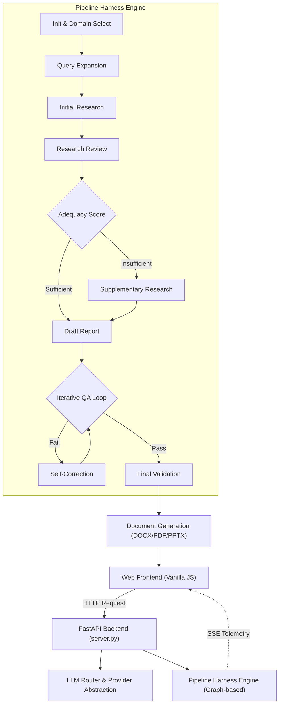

<p align="center">
  
</p>

<h1 align="center">A1trategize - Your AI Strategy Team</h1>

<p align="center">
  <strong>Enterprise-Grade Graph-based Strategic Report Generation System</strong>
</p>

<p align="center">
  <a href="LICENSE"></a>
  
  
  
  
  
  
</p>

<p align="center">
  <em>Release: v0.5 · Author: Minseok Song &amp; Company</em>
</p>

<p align="center">
  <a href="README.md">한국어</a> | <strong>English</strong>
</p>

---

## Overview

**A1trategize** is an enterprise-grade AI consulting system that generates strategic reports across Business, Career, Intellectual Property (IP), and Semiconductor Process (NNFC) domains by orchestrating specialized AI agents.

Moving beyond simple unidirectional text generation, it operates on a **State Machine-based Pipeline Harness Engine composed of Nodes and Conditional Edges**. It analyzes user queries to allocate the optimal domain, combining dynamic prompts with massive knowledge bases (JSON DB) to execute research, critique, drafting, and iterative QA across independent agents.

This entire process is streamed in real-time to the frontend via Server-Sent Events (SSE) using FastAPI, ultimately culminating in professional DOCX, PDF, and PPTX documents.

### Why A1trategize?

| Legacy Single LLM | A1trategize v0.5 (Graph-based Harness) |
|---|---|
| Relies on a single model's response | Separates roles (Research, Critique, Draft, QA) and dynamically routes to the optimal model (Gemini, Solar, Sonar, etc.) |
| Simple prompt input | Harness engine that manages validation, telemetry, and state checkpoints per Node |
| Generic answers lacking domain specificity | 4 independent deep-tech domain modules (Business, Career, IP, Semiconductor) with dedicated Knowledge Bases |
| Blackbox waiting times | Real-time tracking of node progress on the frontend via SSE (Server-Sent Events) |
| Manual copy-pasting | Automatically generates watermarked DOCX, PDF, and presentation-ready PPTX files |

---

## 🚀 Recent Updates (Changelog)

### Checklist-based QA & Domain Guardrail Engine (v0.6)
*Moved away from simple score-based evaluation, building a precise checklist and guardrail system that strictly enforces mandatory requirements for each domain.*

- **Checklist-based Dual QA Gates (`qa_gates.py`)**: Abandoned the subjective 'score' of the QA agent. Instead, it strictly validates mandatory checklist items per domain (e.g., business disclaimers, patent claim formats, prohibiting outcome guarantees in career mode) as JSON arrays. The pipeline only proceeds if all CRITICAL items pass.
- **Domain-Specific Guardrail Validation Nodes (`harness_nodes.py`)**: Introduced dedicated validation nodes for the four major domains, inheriting from `DomainGuardrailValidationNode` within the Harness Engine. It cross-validates fatal domain errors (e.g., missing financial figures, code blocks in patent specs) using regex/keywords and forces self-correction with detailed Re-draft Briefs upon failure.
- **Enhanced NNFC Deep-Tech Safety Validation**: The safety validation node for the semiconductor process mode was significantly reinforced. Integrated with `NNFCEquipmentEngine`, it blocks the generation of fabricated equipment IDs not present in the DB, and strictly cross-references maximum temperatures, available gases, and wafer sizes extracted from the context against equipment limits.
- **Structured JSON Output Support for LLMs (`llm_providers.py`)**: Implemented the `generate_structured()` method for Upstage Solar and Perplexity models to force JSON object outputs, drastically reducing parsing errors and ensuring 100% reliable data structures. (Enabled high-performance reasoning mode for Solar-Pro3).


---

## Core Features

### 4-Domain Deep-Tech Architecture

A1trategize analyzes user questions and loads one of four specialized consulting modules.

| Domain | Description | Key Capabilities |
|---|---|---|
| Business Strategy | MBB-style corporate strategy | Market research, competitor analysis, financial perspectives, execution plans |
| Career Analysis | Personal career & application strategy | Resume analysis, job fit, strengths diagnosis, interview prep |
| IP & Patent Strategy | Intellectual property strategy | Prior art review, specification direction, risk assessment |
| NNFC Process Recipe | Deep-tech semiconductor equipment | NNFC equipment spec validation, structured process recipe design |

### Graph-based Execution Engine
All processes run on the `PipelineHarness` engine. Each agent's task is defined as an independent Node, possessing a graph structure that routes to the next node or a Self-Correction node based on evaluations (Adequacy Scoring, QA).

### LLM Router & Dynamic Assignment
Abstracts hardcoded API calls. The `llm_router.py` dynamically assigns the most suitable LLM model for specific roles (Research, Critique, Draft) at runtime. Users can also change this in real-time via the interface.

---

## System Architecture

### High-Level Overview



---

## Project Structure

```text
A1trategize/
|-- server.py                 # FastAPI backend entry point (REST API & SSE streaming)
|-- main.py                   # Headless runner for CLI testing
|-- harness_engine.py         # Graph-based pipeline workflow state machine
|-- pipeline_service.py       # Harness engine initialization and logic
|-- llm_router.py             # Dynamic router for role-based LLM assignment
|-- prompt_selector.py        # Domain auto-classification & prompt loader
|-- domains/                  # Core modules for the 4 major domains
|   |-- business/             # Prompts and KBs for Business Strategy
|   |-- career/               # Prompts and KBs for Career Analysis
|   |-- ip/                   # Prompts and KBs for IP/Patent Strategy
|   `-- nnfc/                 # Semiconductor prompts, equipment DB, structured engine
|-- static/                   # Frontend static files
|   |-- index.html            # Main Web UI
|   |-- app.js                # SSE tracker and dynamic model selector logic
|   `-- style.css             # Modern UI/UX styling
|-- requirements.txt          # Python dependencies
`-- LICENSE                   # Technical Report Sharing License
```

---

## Tech Stack

| Area | Stack | Role |
|---|---|---|
| Frontend | Vanilla JS, HTML5, CSS3 | Local web interface, SSE progress visualization |
| Backend | FastAPI, Uvicorn, SSE-Starlette | Async API server and real-time state streaming |
| Pipeline Engine | Python Dataclasses, Graph Logic | Node-based state machine (Harness Engine) |
| LLM Client | `google-genai`, `openai`, `requests` | Gemini, Solar, Sonar model routing |
| Document Gen | `python-docx`, `docx2pdf`, `python-pptx` | Document generation logic |

---

## Quality Controls

| Control | Description |
|---|---|
| Domain Selection & Routing | Automatic fallback to predefined keyword matching if LLM domain classification fails |
| Harness Telemetry | Real-time tracking and diagnostics of execution duration and error rates per Node in the Harness Engine |
| Adequacy Scoring | Evaluates the length, figures, references, and keyword frequency of collected data to trigger Supplementary Research |
| Checklist-First QA Gate | Moves beyond simple scores by prioritizing the passage of ALL CRITICAL items in a domain-specific JSON checklist |
| Domain Guardrail Node | Strictly post-validates domain-specific rules via regex/keywords, such as forbidding code blocks in patents or outcome guarantees in resumes |
| NNFC Safety Validation | Blocks fabricated equipment IDs and forces a Re-draft if the generated recipe exceeds equipment-specific limits for temperature, gas, or wafer size |

---

## Public Technical Report Boundary

The public documentation in this repository serves as a technical report describing the system architecture and pipeline.

Included in Public Repository:

| Included | Purpose |
|---|---|
| `README.md` | Main technical documentation (Korean) |
| `README.en.md` | English technical documentation |
| `LICENSE` | Document sharing scope and restrictions |

Excluded from Public Repository:

| Excluded | Reason |
|---|---|
| Source code | IP and implementation detail protection |
| Full prompt text | Prompt asset protection |
| Provider credentials | Security |
| Private datasets | NNFC JSON and private data protection |
| Generated reports | Client/topic-specific output protection |

---

## License and Rights

- Documentation license: [Minseok Song & Company Technical Report Sharing License v1.0](LICENSE)
- Patent reference: KR 10-2026-0009508
- Copyright: 2025-2026 Minseok Song
- Author: Minseok Song & Company

<p align="center">
  <em>Built by Minseok Song &amp; Company</em>
</p>
