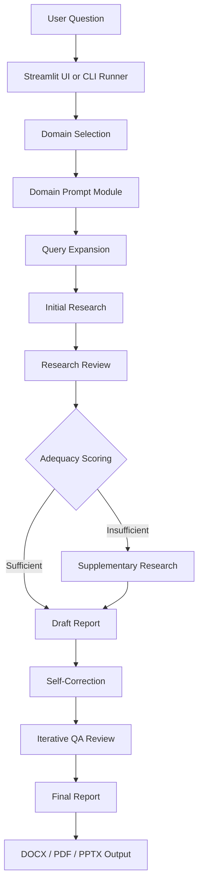

<p align="center">
  
</p>

<h1 align="center">A1trategize - Your AI Strategy Team</h1>

<p align="center">
  <strong>Local Multi-Agent Strategic Report Generation System</strong>
</p>

<p align="center">
  <a href="LICENSE"></a>
  
  
  
  
  
</p>

<p align="center">
  <em>Release: <a href="https://github.com/minseok-ai/Minseok-Song/commit/95e34abf88a5f932d604ee6f50036f5aa9777d3c">Initial deployment</a> · Author: Minseok Song &amp; Company</em>
</p>

<p align="center">
  <strong>한국어</strong> | <a href="README.en.md">English</a>
</p>

---

## Overview

**A1trategize**는 전문화된 AI 역할을 조합하여 비즈니스 전략, 커리어 전략, IP/특허 전략 보고서를 생성하는 로컬 multi-agent 전략 분석 시스템입니다.

이 Initial deployment는 사용자의 전략 질문을 받아 도메인을 선택하고, 조사 자료를 수집한 뒤, 비평, 충분성 평가, 보충 조사, 초안 작성, 자기 수정, 반복 QA를 거쳐 문서 산출물로 정리합니다. 핵심은 단일 응답 생성이 아니라 역할이 분리된 여러 모델 호출과 규칙 기반 검증을 통해 보고서 품질을 단계적으로 높이는 데 있습니다.

공개 저장소는 실제 구현 소스, 프롬프트 전문, provider 자격 증명, 비공개 데이터, 생성 보고서를 포함하지 않는 기술 문서 전용 공간입니다. 이 문서는 공개 가능한 범위에서 시스템 구조와 파이프라인을 설명합니다.

### Why A1trategize?

| 기존 방식 | A1trategize Initial deployment |
|---|---|
| 단일 LLM 응답에 의존 | 조사, 리뷰, 초안, 수정, QA 역할을 분리 |
| 질문을 그대로 검색 또는 생성에 투입 | 질문 확장기를 통해 조사 관점을 구조화 |
| 도메인별 문체와 판단 기준이 섞임 | 비즈니스, 커리어, IP/특허 도메인별 프롬프트 모듈 적용 |
| 자료가 충분한지 감각적으로 판단 | 토큰 길이, 수치 데이터, 참고 근거, 키워드 빈도 기반 충분성 평가 |
| 초안 이후 사람이 직접 검수 | 자기 수정과 반복 QA 루프로 품질 점검 |
| 수동 보고서 편집 | DOCX, PDF, PPTX 산출 흐름 제공 |

---

## 🚀 최근 업데이트 (Changelog)

### 파이프라인 제어 및 자동 검증 고도화 (main.py)
*최신 코드 변경(diff)을 통해 메인 파이프라인의 품질 관리 및 안정성 제어 로직이 크게 강화되었습니다.*

- **비평가(Critic) 모드 및 반복 QA 모듈화**: `main.py` 내부에 하드코딩되었던 QA 로직을 제거하고, `config.py` 기반(통과 기준 점수, 최대 반복 횟수)의 `perform_iterative_qa_loop`로 모듈화했습니다. 또한 초안 작성 직후 '비평가' 페르소나를 통한 자기 성찰(Self-Correction) 단계를 명시적으로 추가하여 보고서 논리력을 극대화했습니다.
- **상세 링크 검증(Link Verification) 로깅**: `verify_and_clean_links` 실행 시 유효하지 않은(Dead/Invalid) 링크의 사유를 추적하고, 터미널에 상세 검증 로그를 출력하도록 개선되었습니다.
- **재무 데이터 면책 조항 검증**: 보고서 최종 저장 직전 `validate_financial_disclaimers`를 호출하여, 재무/수치 데이터가 포함된 경우 필수 면책 조항(Disclaimer)이 포함되었는지 자동으로 확인합니다.

### PPTX 산출 로직 고도화 (템플릿 기반 Consulting Style 적용)
*문서 생성 시각화 및 안정성이 대폭 개선되었습니다.*

- **디자인 템플릿 적용**: 하드코딩된 빈 슬라이드 대신 `pptx_template.pptx`를 불러와 적용하며, 템플릿이 없을 경우 자동으로 기본 템플릿을 생성(`create_default_pptx_template`)하여 적용합니다.
- **표준화된 타이틀 슬라이드**: 첫 슬라이드 제목을 "Strategic Insight Report"로 통일하고, 사용자의 질문(주제)과 보고일자를 부제목에 명확하게 표기하여 컨설팅 보고서의 격식을 갖췄습니다.
- **경량화된 페이지네이션**: 기존의 복잡한 글자 수 기반 동적 페이지네이션을 제거하고, 슬라이드당 12개 항목을 기준으로 깔끔하고 안정적으로 슬라이드를 분리하도록 로직을 단순화했습니다.
- **일관된 파일명 및 표(Table) 지원 지속**: 파일명 인코딩/정규식 오류를 원천 차단하기 위해 `Consulting_Report_{timestamp}.pptx`로 산출 파일명을 고정하였으며, 마크다운 표(`|...|`)의 PPTX 네이티브 표 객체 변환 기능은 그대로 유지 및 안정화되었습니다.

---

## Core Features

### 3-Domain Prompt Architecture

A1trategize는 사용자의 질문을 분석하여 세 가지 전략 분석 모드 중 하나를 선택합니다.

| Domain | Description | Key Capabilities |
|---|---|---|
| Business Strategy | MBB 스타일의 경영 전략 보고서 | 시장 분석, 경쟁 분석, 진입 전략, 재무 관점, 실행 계획 |
| Career Analysis | 개인 커리어 및 지원 전략 분석 | 이력/자기소개서 분석, 직무 적합성, 강점·약점 진단, 면접 대비 |
| IP & Patent Strategy | 지식재산 및 특허 전략 문서 | 선행기술 관점 조사, 명세서/청구항 방향, 권리화 리스크 검토 |

### Domain Selection

도메인 선택은 명시적 사용자 표기, LLM 기반 분류, 키워드 기반 fallback 순서로 처리됩니다. 사용자가 `business`, `career`, `ip` 같은 도메인 힌트를 직접 제공하면 해당 모드를 우선 적용하고, 그렇지 않으면 질문 내용을 분석해 적합한 프롬프트 모듈을 불러옵니다.

### Query Expansion

질문 확장기는 원 질문을 여러 조사 질문으로 분해합니다. XML 형식의 응답을 파싱해 후속 조사에 사용할 질문 목록을 만들고, 파싱 실패나 빈 응답이 발생하면 원 질문으로 되돌아가는 fallback을 둡니다.

### Research, Review, and Adequacy Scoring

초기 조사는 외부 research provider를 통해 수행되고, 리뷰 단계는 조사 결과의 약점과 보충 질문을 정리합니다. 충분성 평가는 자료 길이, 수치 데이터, 참고 근거, 키워드 빈도를 가중치로 계산하여 보충 조사 필요 여부를 결정합니다.

### Drafting and Quality Review

보고서 초안은 조사 결과와 리뷰 내용을 결합해 작성됩니다. 이후 critic persona 기반 자기 수정과 반복 QA 루프를 통해 논리 구조, 근거 품질, 문서 완성도를 점검합니다.

### Document Output

최종 보고서는 Word, PDF, PowerPoint 산출 흐름으로 정리됩니다. Word 문서는 watermark template을 적용할 수 있고, PowerPoint 변환은 긴 보고서 내용을 발표 자료 구조로 나누는 유틸리티 계층을 사용합니다.

---

## System Architecture

### High-Level Overview



### Pipeline Flow

| Step | Component | Responsibility |
|---|---|---|
| 01 | User Input | Streamlit 입력창 또는 `prompts.txt` 기반 CLI 입력 수집 |
| 02 | Domain Selection | 명시적 도메인 표기, LLM 분류, 키워드 fallback으로 분석 모드 선택 |
| 03 | Prompt Loading | 선택된 도메인의 system prompt와 base prompt 조합 |
| 04 | Query Expansion | 원 질문을 조사 가능한 하위 질문으로 확장 |
| 05 | Initial Research | 1차 조사 자료 수집 |
| 06 | Research Review | 조사 결과 비평, 보충 필요 지점, 참고 근거 점검 |
| 07 | Adequacy Scoring | 자료 충분성 점수 계산 및 보충 조사 분기 |
| 08 | Supplementary Research | 충분성 기준 미달 시 추가 조사 수행 |
| 09 | Draft Report | 조사와 리뷰 결과를 기반으로 초안 작성 |
| 10 | Self-Correction | critic persona로 초안의 논리와 표현을 재검토 |
| 11 | QA Loop | 품질 기준 통과 전까지 제한된 반복 검토와 수정 수행 |
| 12 | Document Save | DOCX, PDF, PPTX 파일 생성 |

### LLM Role Assignments

| Role | Provider Family | Current Use |
|---|---|---|
| Research | Perplexity Sonar | 초기 조사 및 보충 조사 |
| Classification | Upstage Solar | 질문 도메인 분류 |
| Query Expansion | Upstage Solar | 조사 질문 확장 |
| Review | Upstage Solar | 조사 결과 비평 및 QA 피드백 |
| Draft | Google Gemini | 보고서 초안 작성 |
| Revision | Google Gemini | 자기 수정 및 최종 수정 |

---

## Project Structure

```text
A1trategize/
|-- app.py                    # Streamlit 기반 로컬 사용자 인터페이스
|-- main.py                   # CLI 실행 경로와 전체 파이프라인 조정
|-- config.py                 # provider client 초기화, 모델명, 품질 기준 설정
|-- query_expander.py         # XML 기반 질문 확장기
|-- report_generator.py       # 조사, 리뷰, 초안, 수정, QA 단계 함수
|-- utils.py                  # XML 파싱, 링크 정리, 충분성 평가, 문서 저장 유틸리티
|-- prompts_base.py           # 공통 persona, 리뷰, QA, 자기 수정 prompt 구조
|-- prompts_business.py       # 비즈니스 전략 도메인 prompt 모듈
|-- prompts_career.py         # 커리어 분석 도메인 prompt 모듈
|-- prompts_IP.py             # IP/특허 전략 도메인 prompt 모듈
|-- keywords.py               # 도메인 fallback 분류용 키워드
|-- prompts.txt               # CLI 실행 시 사용할 질문 입력 파일
|-- style.css                 # Streamlit 화면 스타일
|-- logo.png                  # 공개 문서용 로고
|-- watermark_template.docx   # Word 보고서 템플릿
|-- requirements.txt          # Python 의존성 목록
|-- LICENSE                   # Technical Report Sharing License
`-- .github/workflows/
    `-- sync-public-report.yml # public 기술 문서 저장소 동기화 워크플로우
```

---

## Tech Stack

| Area | Stack | Role |
|---|---|---|
| UI | Streamlit | 로컬 입력 화면과 진행 상태 표시 |
| Runtime | Python 3.8+ | 파이프라인 실행과 문서 생성 |
| LLM Client | `google-genai`, `openai`, `requests` | Gemini, Solar, Sonar 계열 호출 |
| Parsing | XML-style prompt contracts, BeautifulSoup4 | 리뷰/QA 응답 파싱과 링크 정리 |
| Document Generation | `python-docx`, `docx2pdf`, `python-pptx` | Word, PDF, PowerPoint 산출 |
| Resilience | fallback parsing, retry handling, threshold gates | 파싱 실패, 모델 오류, 자료 부족 상황 대응 |

---

## Quality Controls

| Control | Description |
|---|---|
| Domain fallback | LLM 분류 실패 시 키워드 기반 도메인 선택으로 복구 |
| XML parsing fallback | 질문 확장 결과가 비어 있거나 파싱에 실패하면 원 질문 유지 |
| Adequacy scoring | 자료 길이, 수치 데이터, 참고 근거, 키워드 빈도로 보충 조사 여부 판단 |
| Iterative QA | 품질 점수와 승인 여부를 기준으로 제한된 반복 수정 수행 |
| Link cleanup | 최종 보고서 저장 전 링크 검증 및 정리 |
| Financial disclaimer check | 재무 수치가 포함된 보고서에 면책 문구 포함 여부 점검 |

---

## Public Technical Report Boundary

이 저장소의 공개 문서는 시스템 구조와 파이프라인을 설명하기 위한 기술 보고서입니다.

Public repository에 포함되는 항목:

| Included | Purpose |
|---|---|
| `README.md` | 한국어 메인 기술 문서 |
| `README.en.md` | 영문 기술 문서 |
| `README.ko.md` | 한국어 문서 미러 |
| `LICENSE` | 문서 공유 범위와 제한 사항 |
| `logo.png` | 공개 문서 표시용 로고 |

Public repository에서 제외되는 항목:

| Excluded | Reason |
|---|---|
| Source code | 구현 세부사항과 지식재산 보호 |
| Full prompt text | 프롬프트 자산과 운영 노하우 보호 |
| Provider credentials | 보안 정보 보호 |
| Private datasets and knowledge bases | 비공개 자료 보호 |
| Generated reports | 고객/주제별 산출물 보호 |
| Local artifacts | 개발 환경, 캐시, 로그, 임시 파일 제외 |

---

## License and Rights

- Documentation license: [Minseok Song & Company Technical Report Sharing License v1.0](LICENSE)
- Patent reference: KR 10-2026-0009508
- Copyright: 2025-2026 Minseok Song
- Author: Minseok Song & Company

<p align="center">
  <em>Built by Minseok Song &amp; Company</em>
</p>
