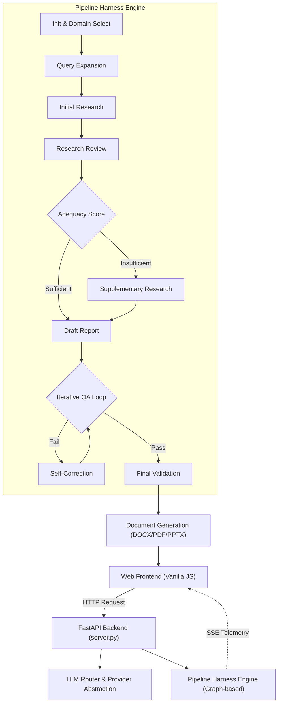

<p align="center">
  
</p>

<h1 align="center">A1trategize - Your AI Strategy Team</h1>

<p align="center">
  <strong>Enterprise-Grade Graph-based Strategic Report Generation System</strong>
</p>

<p align="center">
  <a href="LICENSE"></a>
  
  
  
  
  
  
</p>

<p align="center">
  <em>Release: v0.5 · Author: Minseok Song &amp; Company</em>
</p>

<p align="center">
  <strong>한국어</strong> | <a href="README.en.md">English</a>
</p>

---

## Overview

**A1trategize**는 전문화된 AI 에이전트들을 조합하여 비즈니스, 커리어, 지식재산(IP), 그리고 반도체 공정(NNFC) 도메인의 전략 보고서를 생성하는 엔터프라이즈급 AI 컨설팅 시스템입니다.

단순한 일방향 텍스트 생성을 넘어, **노드(Node)와 조건부 엣지(Conditional Edge)로 구성된 상태 머신 기반의 파이프라인 하네스 엔진(Harness Engine)** 을 통해 작동합니다. 사용자의 질문을 분석해 최적의 도메인을 할당하고, 동적 프롬프트와 방대한 지식 베이스(JSON DB)를 결합하여 조사, 비평, 초안 작성, 반복 QA 과정을 독립적인 에이전트들이 수행합니다.

이러한 전 과정은 FastAPI를 통해 Server-Sent Events(SSE)로 프론트엔드에 실시간 스트리밍되며, 최종적으로 전문적인 DOCX, PDF, PPTX 문서로 변환됩니다.

### Why A1trategize?

| 기존 단일 LLM 방식 | A1trategize v0.5 (Graph-based Harness) |
|---|---|
| 단일 모델 응답에 의존 | 조사, 비평, 초안, QA 역할을 분리하고 최적 모델(Gemini, Solar, Sonar 등)에 동적 라우팅 |
| 단순 프롬프트 입력 | 노드(Node) 단위로 검증, 텔레메트리, 상태 체크포인트를 관리하는 하네스 엔진 |
| 도메인 구분 없는 일반적 답변 | 4개의 독립된 딥테크 도메인 모듈(비즈니스, 커리어, IP, 반도체 공정)과 전용 지식 베이스 |
| 블랙박스 형태의 대기 시간 | SSE(Server-Sent Events)를 통해 프론트엔드에서 노드별 진행 상황을 실시간 트래킹 |
| 텍스트 복사/붙여넣기 | 워터마크가 적용된 DOCX, PDF, 프레젠테이션용 PPTX 자동 생성 |

---

## 🚀 최근 업데이트 (Changelog)

### 신규 딥테크 도메인 확장 및 Graph 기반 엔진 도입 (v0.5)
*반도체 공정 특화 도메인을 추가하고, 파이프라인을 그래프 구조의 하네스 엔진으로 전면 개편했습니다.*

- **신규 딥테크 도메인(NNFC 반도체 공정) 확장 (`domains/nnfc/`)**: 비즈니스, 커리어, 지식재산을 넘어 '반도체 공정 레시피 엔지니어링' 도메인이 새롭게 추가되었습니다. 방대한 장비 스펙 및 구조화된 공정 지식 베이스(JSON)와 전용 제어 엔진(`nnfc_equipment_engine.py`)을 탑재하여 초정밀 딥테크 컨설팅이 가능해졌습니다.
- **Graph 기반 파이프라인 하네스 엔진 구축 (`harness_engine.py`)**: 기존의 단방향 파이프라인을 대체하는 노드(Node)와 조건부 엣지(Edge) 기반의 상태 머신형(Harness) 실행 엔진을 새롭게 구축했습니다. 파이프라인 상태의 텔레메트리(Telemetry), 체크포인트 관리, 실시간 SSE 이벤트 스트리밍 등 엔터프라이즈급 제어가 가능해졌습니다.
- **도메인 모듈화 및 레거시 시스템 청소**: 루트에 혼재되어 있던 모든 프롬프트와 지식 베이스를 4개의 도메인 폴더로 완벽히 격리 및 모듈화했습니다. 구조 변경에 따라 더 이상 호환되지 않는 Streamlit 레거시 UI(`app.py`)와 파편화된 스크립트들을 모두 삭제하여 시스템을 가볍고 안전하게 만들었습니다.
- **프론트엔드 대규모 고도화 (`static/`)**: 신규 하네스 엔진에서 전송되는 실시간 파이프라인 노드 진행 상태를 시각화하고, 추가된 NNFC 도메인 전용 UI/UX를 완벽하게 지원하도록 `app.js`와 `style.css`가 대폭 확장되었습니다.

---

## Core Features

### 4-Domain Deep-Tech Architecture

A1trategize는 사용자의 질문을 분석하여 4가지 전문 컨설팅 모듈 중 하나를 로드합니다.

| Domain | Description | Key Capabilities |
|---|---|---|
| Business Strategy | 기업 경영 전략 및 시장 분석 | 시장 조사, 경쟁사 분석, 재무 관점, 실행 계획 |
| Career Analysis | 개인 커리어 및 지원 전략 | 이력/자소서 분석, 직무 적합성, 강점 진단, 면접 대비 |
| IP & Patent Strategy | 지식재산 및 특허 전략 문서 | 선행기술 조사, 명세서 방향, 권리화 리스크 검토 |
| NNFC Process Recipe | 딥테크 반도체 장비 및 공정 | 국가나노인프라협의체 장비 스펙 정합성, 공정 레시피 설계 |

### Graph-based Execution Engine
모든 과정은 `PipelineHarness` 엔진 위에서 실행됩니다. 각 에이전트의 작업은 독립된 노드(Node)로 정의되며, 평가(Adequacy Scoring, QA) 결과에 따라 다음 노드 또는 재수정(Self-Correction) 노드로 라우팅되는 그래프 구조를 가집니다.

### LLM Router & Dynamic Assignment
하드코딩된 API 호출을 탈피하고 `llm_router.py`를 통해 역할(Research, Critique, Draft)에 가장 적합한 LLM 모델을 런타임에 동적으로 할당합니다. 사용자 인터페이스에서 이를 실시간으로 변경할 수도 있습니다.

---

## System Architecture

### High-Level Overview



---

## Project Structure

```text
A1trategize/
|-- server.py                 # FastAPI 백엔드 진입점 (REST API 및 SSE 스트리밍)
|-- main.py                   # CLI 환경 테스트용 헤드리스 실행기
|-- harness_engine.py         # Graph 기반 파이프라인 워크플로우 상태 머신
|-- pipeline_service.py       # 하네스 엔진 초기화 및 컨설팅 파이프라인 로직
|-- llm_router.py             # 역할별 LLM 모델 동적 할당 라우터
|-- prompt_selector.py        # 도메인 자동 분류 및 프롬프트 동적 로더
|-- domains/                  # 4대 도메인(Business, Career, IP, NNFC) 핵심 모듈 폴더
|   |-- business/             # 비즈니스 전용 프롬프트 및 지식 베이스
|   |-- career/               # 커리어 전용 프롬프트 및 지식 베이스
|   |-- ip/                   # 특허 전용 프롬프트 및 지식 베이스
|   `-- nnfc/                 # 반도체 공정 프롬프트, 장비 DB, 구조화 엔진
|-- static/                   # 프론트엔드 정적 파일
|   |-- index.html            # 메인 웹 UI
|   |-- app.js                # SSE 트래커 및 동적 모델 셀렉터 제어 로직
|   `-- style.css             # 모던 UI/UX 스타일
|-- requirements.txt          # Python 패키지 의존성
`-- LICENSE                   # Technical Report Sharing License
```

---

## Tech Stack

| Area | Stack | Role |
|---|---|---|
| Frontend | Vanilla JS, HTML5, CSS3 | 로컬 웹 인터페이스, SSE 진행 상태 시각화 |
| Backend | FastAPI, Uvicorn, SSE-Starlette | 비동기 API 서버 및 실시간 상태 스트리밍 |
| Pipeline Engine | Python Dataclasses, Graph Logic | 노드 기반 상태 머신 (Harness Engine) |
| LLM Client | `google-genai`, `openai`, `requests` | Gemini, Solar, Sonar 모델 호출 (Router 패턴) |
| Document Gen | `python-docx`, `docx2pdf`, `python-pptx` | 문서 생성 로직 |

---

## Quality Controls

| Control | Description |
|---|---|
| Domain Selection & Routing | LLM 도메인 분류 실패 시 사전에 정의된 키워드 기반 fallback 매칭으로 자동 복구 |
| Harness Telemetry | 파이프라인 엔진에서 노드별 소요 시간(Duration) 및 에러를 실시간으로 추적 및 진단 |
| Adequacy Scoring | 수집된 기초 자료의 길이, 수치, 참고 근거, 키워드 빈도를 종합 평가하여 보충 조사(Supplementary Research) 분기 |
| Iterative QA Loop | QA 에이전트의 품질 점수 및 승인 여부에 따라, 최대 허용 횟수 내에서 자체 수정(Self-Correction) 루프 실행 |
| Safety & Compliance | 재무 수치 포함 시 면책 조항 삽입 강제화 및 NNFC 반도체 장비 ID 스펙 정합성 검증 |

---

## Public Technical Report Boundary

이 저장소의 공개 문서는 시스템 구조와 파이프라인을 설명하기 위한 기술 보고서입니다.

Public repository에 포함되는 항목:

| Included | Purpose |
|---|---|
| `README.md` | 한국어 메인 기술 문서 |
| `README.en.md` | 영문 기술 문서 |
| `LICENSE` | 문서 공유 범위와 제한 사항 |

Public repository에서 제외되는 항목:

| Excluded | Reason |
|---|---|
| Source code | 구현 세부사항과 지식재산 보호 |
| Full prompt text | 프롬프트 자산과 운영 노하우 보호 |
| Provider credentials | 보안 정보 보호 |
| Private datasets | NNFC JSON 등 비공개 자료 보호 |
| Generated reports | 고객/주제별 산출물 보호 |

---

## License and Rights

- Documentation license: [Minseok Song & Company Technical Report Sharing License v1.0](LICENSE)
- Patent reference: KR 10-2026-0009508
- Copyright: 2025-2026 Minseok Song
- Author: Minseok Song & Company

<p align="center">
  <em>Built by Minseok Song &amp; Company</em>
</p>
